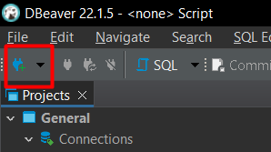
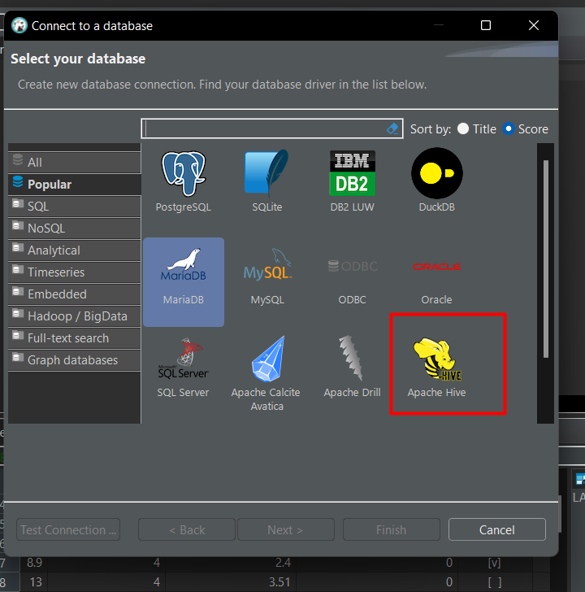
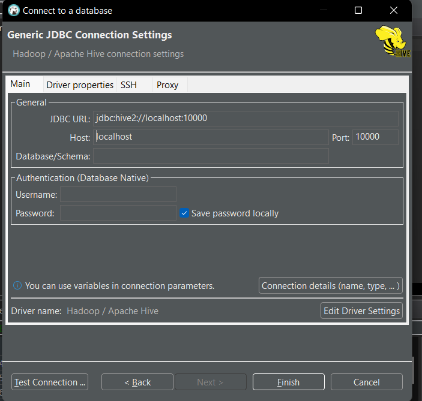

# hive
local hive enviroment

## Get started
To run this project, you will need to install

* docker (https://docs.docker.com/engine/install/)
* dbeaver (https://dbeaver.io/download/)

After that, clone the repo and up the docker-compose, with the hive components
```bash
git clone https://github.com/perebaj/hive.git
cd hive
docker-compose up -d
```

go in dbeaver and point to local DW that you just instantiated





# Apresentação

https://dapper-boater-ea7.notion.site/Apresenta-o-2-Processamento-de-dados-em-escala-22988c9ff7184258a66425774726fe81


